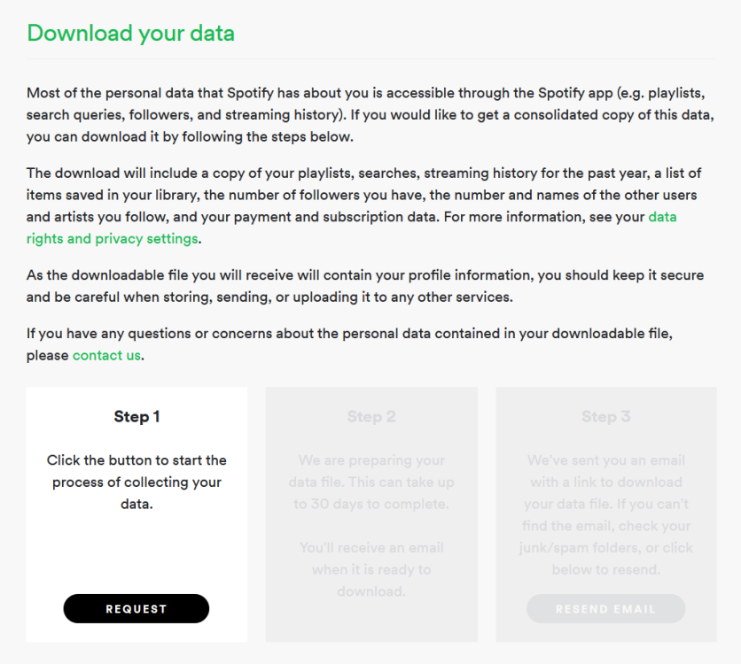

# Spotify Wrapped Plus: A Python program that help you understand your Spotify listening habits more

## How to use Spotify Wrapped Plus?

### Step I: Requesting Listening History From Spotify:

#### 1. Head to https://www.spotify.com/ca-en/account/privacy/ and request your data under the 'Download your data' section

#### 2. After receiving your data in your email box (might take a few days), extract your data from the .zip file

### Step II. Compile and run 'Main.py' on your machine

#### 1. Drag and Drop 'MyData' folder into the drop box

#### 2. After the drop box accepts your data, customize your data with the selection window

#### 3. Press 'Finish' after you finish customizing your data, then close the window to generate your result

#### 4. Your data will be generated within 'MyData' Folder, enjoy :)